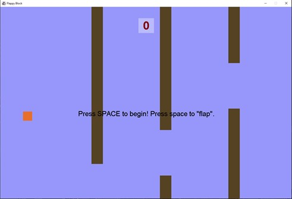

# 1.1 Flappy Block Game Clone Overview

**Overview written by Peter Mitchell.**

## Contents

```
1.1 Flappy Block Game Clone Overview
1.2 Introduction
1.3 The Rules of Flappy Block
1.4 High Level Discussion About Implementation
1.5 How the Core Game Works
1.6 Features You Could Add
```
# 1.2 Introduction

This document will explain the fundamentals of how the Flappy Block game works. 

- ([Youtube Demo](https://youtu.be/JSSfoseU8CQ))

# 1.3 The Rules of Flappy Block

Flappy Block is a simplified copy of Flappy Bird. Following a very similar set of rules, except instead of
a bird, the player’s character is presented as a flying block. The following list of rules define the core
game.

- The game starts when the space bar is pressed.
- The player’s block will accelerate downward at a constant rate and pressing space bar will
    offset this downward velocity with an instant burst of upward force to simulate a flap.
- The player can only move up and down.
- Obstacles that block a portion of the playable area will continue to move toward the player
    with a gap.
- Colliding with the visual part of the obstacle will instantly end the game.
- Successfully passing each obstacle awards the player with a point.


# 1.4 High Level Discussion About Implementation

The game can be seen below in the screenshot where the player’s block is orange. The brown
rectangles are obstacles that will move consistently toward the player. The number at the top middle
is the score, and the text in the middle of the game indicates how to begin and play.



The game has been divided up into a small set of classes to separate functionality in a logical way. A
Position class is used to define positions and velocities on the x and y axis. A CollidableRect has been
defined to provide a generic definition of a rectangle that can have collisions detected. This is used for
the FlappyBlock and Obstacle classes to make the functionality shared. The GamePanel handles all the
game state information and management of the FlappyBlock and multiple Obstacles. Then the last
class that ties everything together is the Game class that creates the frame and passes on events for
the update timer and key events.

# 1.5 How the Core Game Works

This section will break down each of the classes that have been defined and the different methods
that provide functionality to them. Starting from the lowest level classes the first two to look at are
the Position and CollidableRect. They provide the most generic functionality that is used throughout
the other classes. Starting with the Position class it simply stores an x and y coordinate and provides
the following methods to give functionality.

- setPosition(): Changes the position to the specified x and y.
- equals(): Checks if the position is equal to another position object.

The CollidableRect class stores a Position for the top left corner, and a width and height to give a set
of bounds. A colour is also stored to for rendering the rect with a paint method. The following methods
give it behaviour.

- isCollidingWith(): Checks if a CollidableRect is colliding with another specified ColldibableRect.
- paint(): Draws the rect with specified bounds and colour.


The next classes to consider are those that extend from the ColldiableRect. The FlappyBlock represents
a single CollidableRect, while the Obstacle has three ColldiableRects. The FlappyBlock has variables to
control the size, start position, amount of gravity (for constant downward acceleration), the force
applied for flaps, whether a flap has been initiated and the current vertical velocity. This information
is all used to manage the FlappyBlock with the following methods.

- update(): Updates the velocity based on gravity and if a flap has been applied then modifies
    the block’s position.
- reset(): Resets the velocity, and positions it centred vertically.
- flap(): Sets the block to flap during the next update.
- isOutOfBounds(): Checks if the block is too high up or too low down to trigger a game over.

The Obstacle objects are designed to be reused with shuffling back to a default position each time
they move past the end of the screen. They are made up of three ColldiableRects. Two for the brown
rectangles that will cause a game over from colliding, and one to check for the player getting past the
other two. The rect to apply score is not drawn, but you can make it draw to see where it is located
by uncommenting line 113 in Obstacle.java. The gap between obstacles is constant, but the height is
randomised. The following methods provide additional functionality to the Obstacles.

- update(): Updates the obstacle to move it some amount to the left. If the obstacle has moved
    off screen the reset() method is called.
- reset(): Moves the obstacle just off screen with a new randomised vertical offset.
- isCollidingForLoss(): Called using FlappyBlock to check if the FlappyBlock is colliding with
    either of the brown top or bottom obstacles.
- isCollidingForScore(): Called using FlappyBlock to check if colliding with the score rectangle.
    This is only true once for each time it moves across the screen.
- paint(): Draws the top and bottom rectangles for the Obstacle.
- randomiseOffset(): Randomises the vertical offset called when applying a reset() or when the
    object is created.

The last two classes that tie everything together are the GamePanel and Game classes. The GamePanel
does most of the work managing the game state, all the obstacles, and the player’s flappy block. It is
responsible for most of the management of the game. The following methods provide functionality.

- update(): If the game is currently playing it will move the obstacles by a fixed amount to the
    left, update the flappyBlock, and then check for collisions with being outside bounds, for a
    game over state, or a score increase.
- processInput(): Checks the input passed from the Game class. Pressing escape exits the game,
    pressing space will start the game, or make the block flap, and pressing R will make the game
    restart.
- paint(): Draws all the obstacles, the flappy block, the score, and any game over or wait for
    begin messages to the panel.
- reset(): Resets the flappy block, score, and game state back to defaults along with a fresh set
    of obstacles.
- showScore(): Draws the score to the top middle of the screen with a background rectangle
    around it.
- showEndText(): Draws the game over message in the middle of the screen.
- showStartText(): Draws the wait for begin message in the middle of the screen.
- createObstacles(): Creates enough obstacles to fill the screen.


The last class is the Game class. It is responsible for creating the JFrame, managing the key input, and
managing the timer. The following methods provide functionality for the class.

- startGame(): Starts the timer for updates.
- actionPerformed(): Called by the timer on a fixed interval to make the GamePanel update().
- keyReleased(): Called when a key is released and passes the key on to processInput() in the
    GamePanel.

# 1.6 Features You Could Add

There are many different improvements that could be applied to the game to either bring it up to the
standard of the normal Flappy Bird game, or to move it more toward your own creation. The following
list are some of the things you could try and change to improve the game.

- Add more variety of Obstacles. These could be different shapes, or more visually appealing in
    some other way.
- Make the block show a flap animation for a few frames after the flap has been pressed.
- Add additional collectable elements that can be collected for bonus points along the path.
- Try changing the gap between obstacles either vertically and/or horizontally.
- Make the game increase in difficulty over time as you get to a higher score. Or perhaps have
    the player select a difficulty before they play.
- Add lives so that the player does not immediately lose all their score when colliding.
- Add additional collectibles that can randomly appear for special effects (eg, disabling collisions
    for some period of time, or speeding up/slowing down time).
- Make the game more graphical with graphics instead of just plain colours.
- Come up with your own unique rules to change the game.


